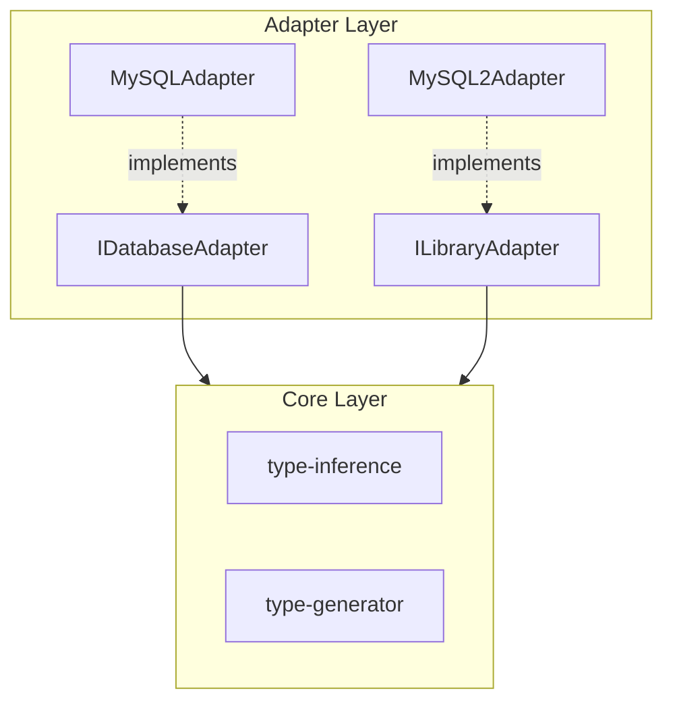

# adapters Directory

## Responsibility

Abstract connections to external systems (databases, libraries).
Based on DIP (Dependency Inversion Principle), separate core logic from external dependencies.

## Architecture



## File Structure

```
adapters/
├── overview.md
├── interfaces.ts              # Adapter interfaces
├── mysql-adapter.ts           # MySQL DB adapter
├── mysql2-library-adapter.ts  # mysql2 library adapter
└── index.ts
```

## Interfaces

### IDatabaseAdapter

Retrieve metadata from the database:

```typescript
interface IDatabaseAdapter {
  connect(): Promise<void>;
  disconnect(): Promise<void>;
  getQueryMetadata(sql: string): Promise<QueryMetadata>;
}
```

### ILibraryAdapter

Extract SQL from AST and manipulate type annotations:

```typescript
interface ILibraryAdapter {
  isTargetMethod(node: CallExpression): boolean;
  extractSql(node: CallExpression): string | null;
  getExistingTypeAnnotation(node: CallExpression): ExistingType | null;
  generateFix(node: CallExpression, typeString: string): Fix;
  getQueryOptions(node: CallExpression): QueryOptions;
}
```

## Module Details

### mysql-adapter.ts

Connect to MySQL database and retrieve metadata via PreparedStatement.

Key features:

- Execute PreparedStatement (PREPARE → stmt.fields → DEALLOCATE)
- Retrieve ENUM values from INFORMATION_SCHEMA
- Detect nullable flags
- Connection pooling

```typescript
class MySQLAdapter implements IDatabaseAdapter {
  constructor(config: DatabaseConfig);
  async connect(): Promise<void>;
  async disconnect(): Promise<void>;
  async getQueryMetadata(sql: string): Promise<QueryMetadata>;
  static isSelectQuery(sql: string): boolean;
}
```

### mysql2-library-adapter.ts

mysql2 library-specific AST operations.

Key features:

- Detect `pool.execute()`, `pool.query()` calls
- Extract SQL from string literals / template literals
- Parse existing type annotation `<Type>`
- Generate Fix objects for autofix
- Detect `nestTables`, `rowsAsArray` options

```typescript
class MySQL2Adapter implements ILibraryAdapter {
  isTargetMethod(node: CallExpression): boolean;
  extractSql(node: CallExpression): string | null;
  getExistingTypeAnnotation(node: CallExpression): ExistingType | null;
  generateFix(node: CallExpression, typeString: string): Fix;
  getQueryOptions(node: CallExpression): QueryOptions;
  hasRowDataPacketImport(program: Program): boolean;
  getRequiredImport(): string;
}
```

## Design Principles

- Loose coupling through interfaces
- Consider future extensions (PostgreSQL, Prisma, etc.)
- Centralize database connection responsibility here
- Encapsulate AST operation details
