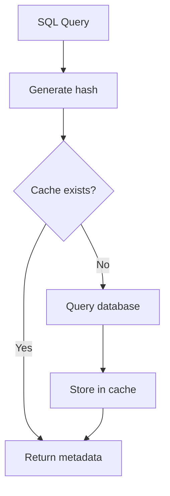

# cache

## Responsibility

Cache SQL query metadata to reduce duplicate queries to the database.
An essential component for maintaining ESLint execution performance.

## Caching Strategy



## Module Details

### cache.ts

File-based persistent cache system.

```typescript
class QueryCache {
  constructor(options: CacheOptions);

  generateKey(sql: string): string;
  async get(sql: string): Promise<QueryMetadata | null>;
  async set(sql: string, metadata: QueryMetadata): Promise<void>;
  async delete(sql: string): Promise<void>;
  async clear(): Promise<void>;
}
```

### Cache Key Generation

```sh
key = hash(normalize(SQL) + schemaVersion)
```

Normalization process:

- Unify whitespace (newlines, tabs → spaces)
- Compress consecutive spaces
- Trim leading/trailing whitespace
- Lowercase keywords (SELECT, FROM, etc.)

### Schema Version

Mechanism to invalidate cache when schema changes:

```typescript
// eslint.config.js
{
  settings: {
    "sql-typing": {
      schemaVersion: "2024-01-15-add-status-column"
    }
  }
}
```

When the version changes, all cache entries become invalid.

## Cache File Format

```sh
.sql-typing-cache/
├── v1/                    # schemaVersion
│   ├── abc123.json        # First 6 characters of hash
│   ├── def456.json
│   └── ...
└── cache-meta.json        # Meta information
```

Content of each JSON file:

```json
{
  "sql": "SELECT id, name FROM users",
  "metadata": {
    "columns": [{ "name": "id", "type": "INT", "typeCode": 3, "nullable": false }]
  },
  "createdAt": "2024-01-15T10:00:00Z"
}
```

## Design Principles

- File-based persistence (shareable across processes)
- Also support in-memory mode (for testing)
- Minimize cache miss cost
- Resilience to corrupted files (read failure → treated as cache miss)
- Thread-safe writes (atomic write)
