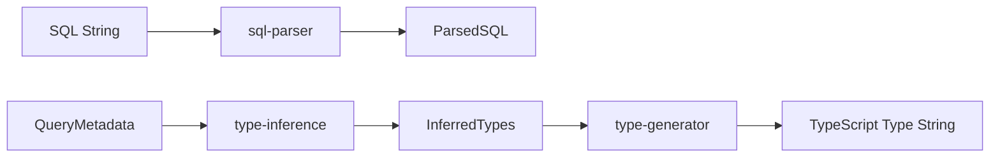

# core Directory

## Responsibility

Provide core logic for SQL query analysis and TypeScript type generation.
Perform pure transformation operations independent of databases or libraries.

## Processing Flow



## File Structure

```
core/
├── overview.md
├── sql-parser.ts      # SQL parsing
├── type-inference.ts  # Type inference
├── type-generator.ts  # Type string generation
└── index.ts
```

## Module Details

### sql-parser.ts

Extract column and table information from SQL strings.

**Input**: SQL string
**Output**: ParsedSQL (column names, aliases, tables, aggregate function info)

```typescript
function parseSql(sql: string): ParsedSQL;
```

Key features:

- Extract columns from SELECT clause
- Detect AS aliases
- Parse table references (table.column)
- Detect aggregate functions (COUNT, SUM, etc.)
- Extract tables from JOIN clauses

### type-inference.ts

Convert MySQL metadata to TypeScript types.

**Input**: QueryMetadata (obtained from DB adapter)
**Output**: InferredTypes

```typescript
function inferTypes(metadata: QueryMetadata): InferredTypes;
```

Type mapping:

| MySQL Type                                             | TypeScript Type |
| ------------------------------------------------------ | --------------- |
| INT, TINYINT, SMALLINT, MEDIUMINT, FLOAT, DOUBLE, YEAR | `number`        |
| BIGINT, DECIMAL                                        | `string`        |
| VARCHAR, CHAR, TEXT, TIME                              | `string`        |
| DATE, DATETIME, TIMESTAMP                              | `Date`          |
| JSON                                                   | `unknown`       |
| BLOB                                                   | `Buffer`        |
| ENUM                                                   | union type      |

### type-generator.ts

Generate TypeScript type strings from inferred type information.

**Input**: InferredTypes, options
**Output**: Type string

```typescript
function generateTypeString(types: InferredTypes, options?: GeneratorOptions): string;
```

Options:

- `format`: 'mysql2' | 'plain'
- `nestTables`: boolean
- `rowsAsArray`: boolean

Output examples:

```typescript
// Standard
"(RowDataPacket & { id: number; name: string })[]";

// nestTables: true
"(RowDataPacket & { users: { id: number }; posts: { title: string } })[]";

// rowsAsArray: true
"[number, string][]";
```

## Design Principles

- No external dependencies (pure functions)
- Prioritize testability
- Single responsibility for each function
- Called from the adapters layer
