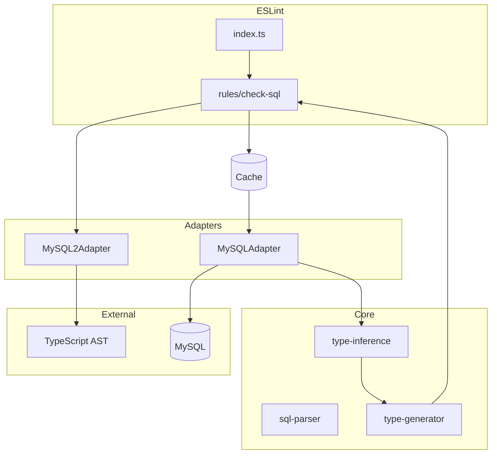
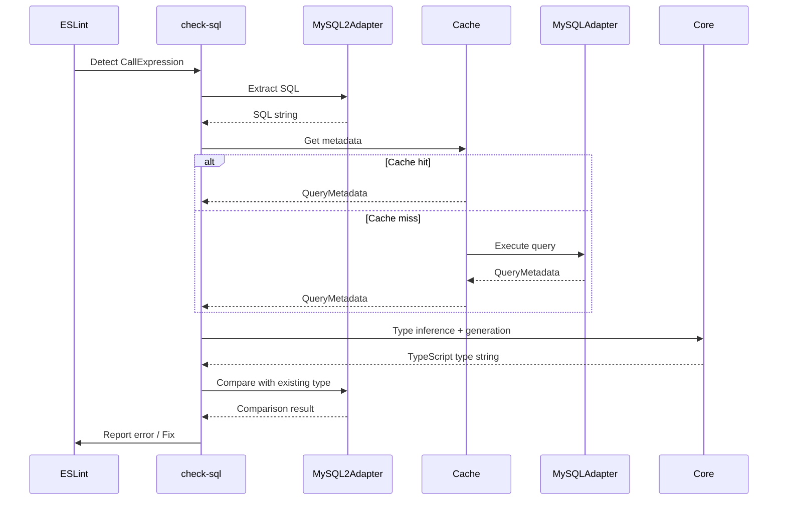
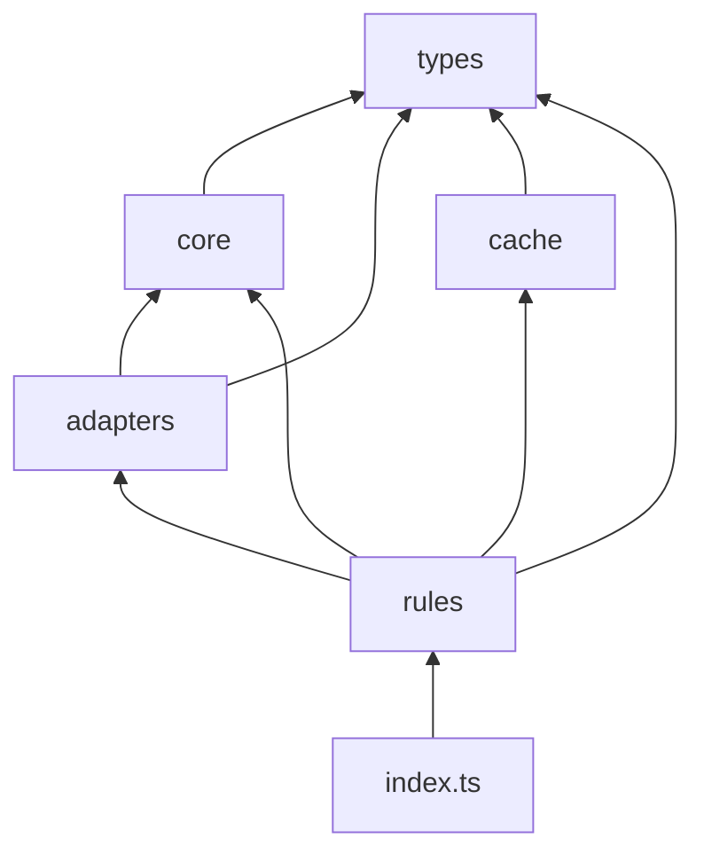

# eslint-plugin-sql-typing

## Overview

An ESLint plugin that auto-generates TypeScript types from SQL queries.
Validates and auto-fixes type annotations for mysql2 `execute()` / `query()` methods.

## Directory Structure

```sh
src/
├── overview.md           # This file
├── index.ts              # Plugin entry point
├── types/                # Common type definitions
├── core/                 # Core logic (DB/library independent)
├── adapters/             # External system connections
├── cache/                # Query cache
└── rules/                # ESLint rules
```

## Overall Architecture



## Data Flow



## Dependencies



## Module Responsibilities

| Module      | Responsibility                                                   |
| ----------- | ---------------------------------------------------------------- |
| `types/`    | Common type definitions. No dependencies on other modules        |
| `core/`     | SQL parsing, type inference, type generation. Pure functions     |
| `adapters/` | DB connection, AST operations. Encapsulate external dependencies |
| `cache/`    | Metadata caching. Maintain performance                           |
| `rules/`    | ESLint rules. Integrate all components                           |
| `index.ts`  | Export as plugin                                                 |

## Entry Point

```typescript
// index.ts
export default {
  rules: {
    "check-sql": checkSqlRule,
  },
  configs: {
    recommended: {
      plugins: ["sql-typing"],
      rules: {
        "sql-typing/check-sql": "error",
      },
    },
  },
};
```

## Configuration Example

```javascript
// eslint.config.js
import sqlTyping from "eslint-plugin-sql-typing";

export default [
  {
    plugins: {
      "sql-typing": sqlTyping,
    },
    rules: {
      "sql-typing/check-sql": "error",
    },
    settings: {
      "sql-typing": {
        database: {
          host: "localhost",
          port: 3306,
          user: "root",
          password: "password",
          database: "myapp",
        },
        schemaVersion: "v1",
      },
    },
  },
];
```
