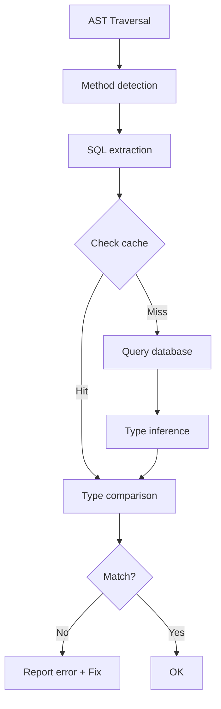

# check-sql Rule Documentation

## Processing Flow



## check-sql Rule

### Message IDs

| ID              | Description                 |
| --------------- | --------------------------- |
| `missingType`   | Type annotation is missing  |
| `typeMismatch`  | Type does not match         |
| `missingColumn` | Column is missing from type |
| `extraColumn`   | Extra column in type        |

### Rule Implementation

```typescript
const checkSqlRule: Rule.RuleModule = {
  meta: {
    type: "problem",
    docs: {
      description: "Enforce correct type annotations for SQL queries",
    },
    fixable: "code",
    messages: {
      missingType: "Missing type annotation for SQL query",
      typeMismatch: "Type mismatch for column '{{column}}': expected {{expected}}, got {{actual}}",
      missingColumn: "Missing column '{{column}}' in type annotation",
      extraColumn: "Extra column '{{column}}' in type annotation",
    },
    schema: [], // Option schema
  },

  create(context) {
    return {
      CallExpression(node) {
        // 1. Check if it's a mysql2 method
        // 2. Extract SQL string
        // 3. Get metadata from cache or DB
        // 4. Infer types
        // 5. Compare with existing type annotation
        // 6. Report error + provide Fix if mismatch
      },
    };
  },
};
```

### Autofix Behavior

**When type is missing**:

```typescript
// Before
const [rows] = await pool.execute("SELECT id FROM users");

// After
const [rows] = await pool.execute<(RowDataPacket & { id: number })[]>("SELECT id FROM users");
```

**When type is incorrect**:

```typescript
// Before
const [rows] = await pool.execute<
  (RowDataPacket & { id: string })[] // string is wrong
>("SELECT id FROM users");

// After
const [rows] = await pool.execute<
  (RowDataPacket & { id: number })[] // Fixed to number
>("SELECT id FROM users");
```

### Import Addition

When `RowDataPacket` import is missing, it's automatically added:

```typescript
// Added import
import type { RowDataPacket } from "mysql2/promise";
```
